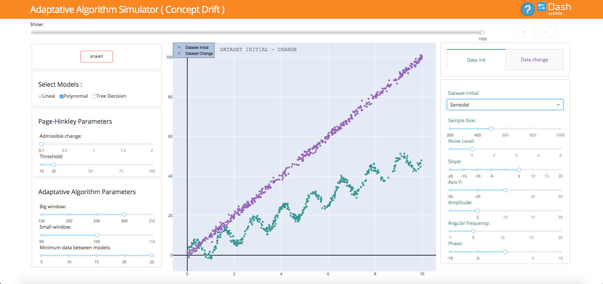
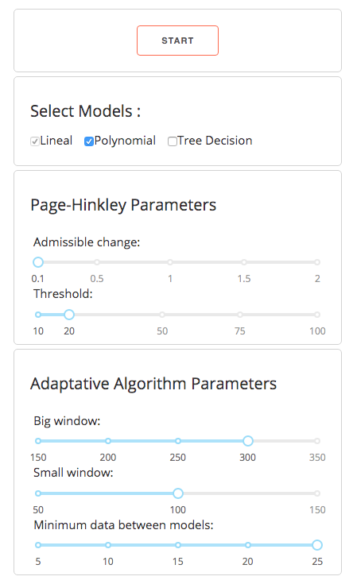
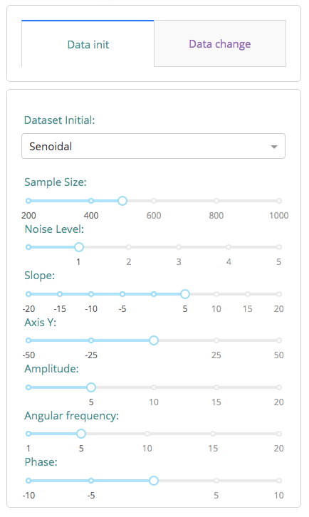
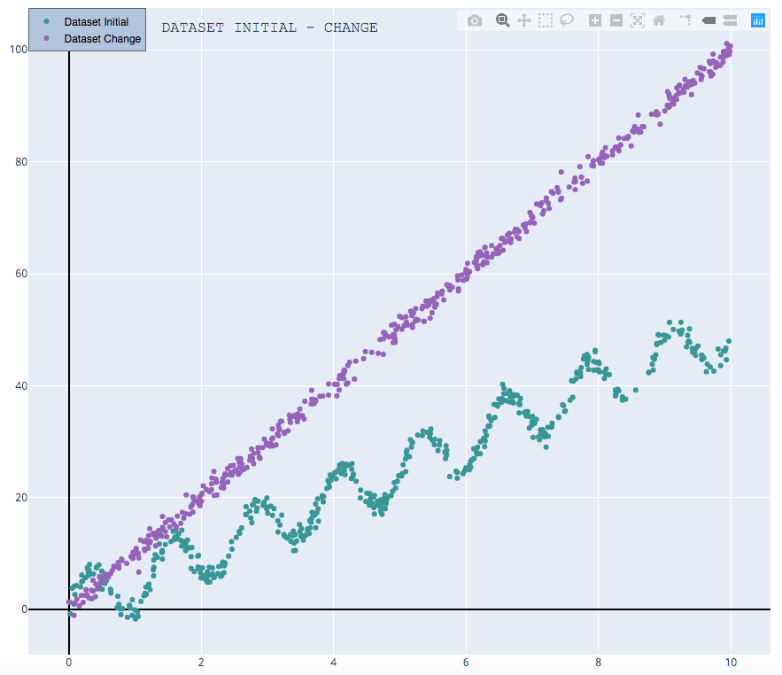

# Adaptative Algorithm Simulator (Concept Drift)

Es una aplicación que utiliza los algoritmos implementados en las librerías [Algoritmo Adaptativo](https://github.com/ogomezr/concept-drift-library) con una finalidad de ofrecer una herramienta educativa y de exploración con los diferentes parámetros disponibles y la creación de diferentes sets de datos de manera sencilla.
Desarrollado con Python y [Dash Plotly](https://plot.ly/dash/).


<p>&nbsp;</p>
<p align="center">
  
</p>
<p>&nbsp;</p>

##  Instrucciones de uso con Docker

La manera más sencilla de utilizar la aplicación es con el uso de Docker.
* [Instalación Docker](https://docs.docker.com/install/)

Una vez disponemos de docker, ejecutamos el contenedor con el comando:

```
sudo docker run -it --rm  -p 8050:8050 ogomezr/concept-drift-simulator
```

De esta manera, no es necesario descargar el repositorio ni la instalación de librerías adicionales.

Para acceder a la aplicación acceder desde tu navegador a la url:

```
http://0.0.0.0:8050/
```
Para cambiar de puerto se debe cambiar el puerto en la comando de ejecución del contenedor.

## Instrucciones de uso para ejecutar la aplicación localmente.

### Pre-requisitos 📋
Para utilizar esta librerías es necesario disponer de Python instalado en tu equipo. 
* [Python](https://www.python.org/downloads/)

Una vez disponemos de Python, descargar el repositorio desde GitHub o usando desde la consola el comando:

```
git clone https://github.com/ogomezr/concept-drift-simulator
```


### Instalación 🔧

#### Paso 1
Acceso a la carpeta del repositorio.
```
cd concept-drift-simulator
```
#### Paso 2 ( Opcional ) 
Uso de entorno virtual para la instalación del proyecto y librerías necesarias

Creación entorno virtual desde la línea de comandos:
```
python -m venv conceptdrift
```
Activación entorno virtual (Linux/Mac):

```
source ./conceptdrift/bin/activate
```
Activación entorno virtual (Win):

```
./conceptdrift/Scripts/activate
```

#### Paso 3
Instalación de las librerías necesarias:
```
pip install -r requirements.txt
```

### Ejecución

#### Paso 4

Ejecución en modo Producción:

```
gunicorn -b 0.0.0.0.8050 app:server
```

Ejecución en modo desarrollo (NO RECOMENDADA : la aplicación funciona de manera menos eficiente.)

```
python app.py
```

#### Paso 5
Abrimos la siguiente url en el navegador:
```
http://0.0.0.0:8050/
```
## Manual de usuario 

La aplicación se didive en dos diferentes secciones, la que se presenta
nada mas iniciar al usuario, la cual corresponde a la sección de elección de
diferentes opciones y la sección de analisis de la ejecución después de ejecutar
el algoritmo.
### Sección de configuración.
Esta sección es previa a ejecución de algoritmo.
<p>&nbsp;</p>
<p align="center">
  
</p>
<p>&nbsp;</p>
Ambas secciones comparten el header, que contiene el titulo de la aplicación, 'Adaptative Algorithm Simulator ( Concept Drift)', un botón de ayuda que nos redirige a este repositorio y a este manual.
También dispone de el logo y enlace del framework usado para el desarrollo de la aplicación Dash Plotly.
    
Podemos observar que claramente la aplicación se divide en 3 columnas, la izquierda, correspondiente a los parametros del algoritmo, como son los suyos propios o bien los parámetros del test de Page-Hinkley.
    
La parte central muestra los datos generados que serán los que el algoritmo procese cuando pulsemos el botón START. 
    
La columna de la derecha muestra las opciones para generar los datos.
#### Columna izquierda.
<p>&nbsp;</p>
<p align="center">
  
</p>
<p>&nbsp;</p>

* **Start:** El boton START comienza la ejecución del algoritmo adaptativo, lo cual nos lleva a la sección de análisis posterior a la ejecución de este.
* **Select Models:** Nos permite elegir que modelos queremos usar. Lineal, Polynomial y Tree Decision.
* **Page-Hinkley Parameters:** Admissible change corresponde al valor $sigma$ y Threshold al valor $lambda$, los parámetros explicados en anteriores secciones.
* **Adaptative Algorithm Parameters:** Big window corresponde al tamaño maximo de la ventana de datos, Small Window corresponde al tamaño mínimo de la ventana de datos cuando detectamos un cambio, para ser mas reactivo a dicho cambio y Minimum data between models retringe la posibilidad de cambiar modelo si no han llegado $k$ datos entre cada modelo.

#### Columna derecha.
<p>&nbsp;</p>
<p align="center">
  
</p>
<p>&nbsp;</p>

Esta columna dispone de dos Tabs, Data init y Data change.

* **Data init:** Este dataset se genera a usando la función seleccionada en el desplegable, tenemos como opción la funcion lineal, polinomial y senoidal, al elegir cada una de ellas los parámetros a usar cambian automáticamente.
 El modelo inicial del algoritmo será un dataset del mismo tipo que Data init y con los mismos parámetros, con el tamaño correspondiente a la ventana de datos máxima, una vez pulsado el botón START en la columna izquierda, cada uno de los puntos generados en Data Init llegará secuencialmente al algoritmo para procesarlos.
* **Data change:** al pulsar en el tab Data change, disponemos de las opciones para elegir los datos, una vez se pulse el botón START y todos los puntos de Data init se procesen, llegará el turno para este dataset.

El color de estas opciones, verde para Data init, y morado para Data change corresponden en la gráfica central con estos para ayudar a un mayor compresión de los datos generados.

#### Columna central.
<p>&nbsp;</p>
<p align="center">
  
</p>
<p>&nbsp;</p>

Los gráficos son totalmente interactivos, se puede ampliar/reducir/guardar entre otras opciones usando las herramientas en la parte superior derecha del gráfico.
Representa los datos generados por las diferentes funciones y parámetros de los set de datos.
Utilizando la leyenda en la parte superior izquierda se puede elegir que datos mostrar o no mostrar.


## Autor ✒️

* *Óscar Gómez* - [ogomezr](https://github.com/ogomezr)
 
## Licencia 📄

Este proyecto está bajo la Licencia MIT - más detalles en el archivo LICENSE.
